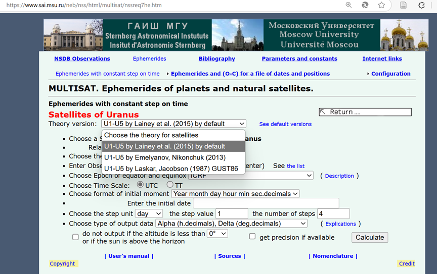
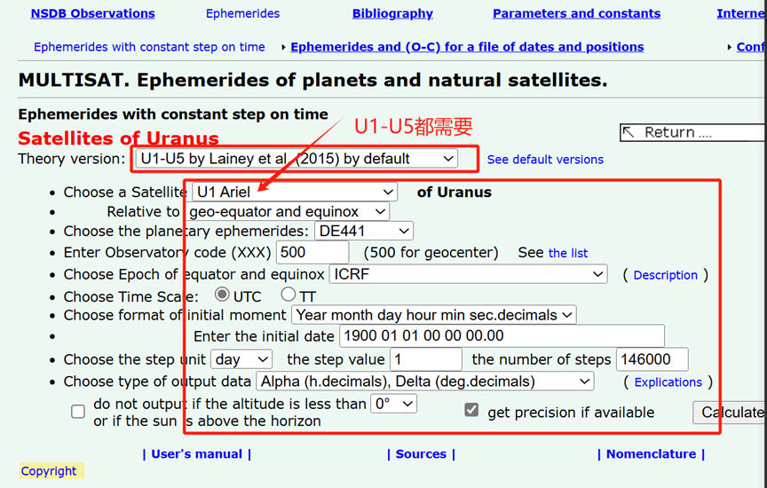
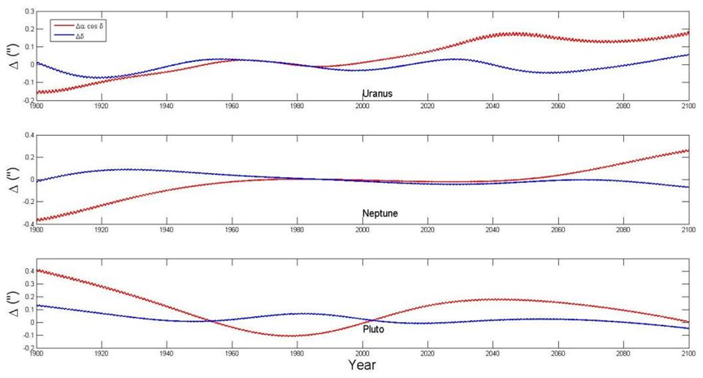

目的：画出两个天王星卫星（U1-U5）历表在1900-2100年间的差异，表明我们现在开展地面实测及轨道改进的意义。

网址进入：[IMCCE-SAI: Natural Satellites Service. Ephemerides](https://www.sai.msu.ru/neb/nss/html/multisat/nssreq7he.htm)

进入后的设置：

1.  选择卫星历表模型（Lainey et al. 2015）

2.  按照以下设置，测站选择地心500标号。其他的都是下图的设置。

2. 需要将U1-U5每个都选择一遍。生成第一种模型的1900-2100的历表，然后再生成第二种模型的这个的历表。然后针对每颗卫星的两种模型历表位置，做相减计算，求出赤经和赤纬的残差值，将残差值进行绘图。

3. 相减时注意：赤经o-c=(ra2\*15-ra1\*15)\*cos de1\*15 \*3600(\*15是为了时转为度，\*3600是度转为角秒) 赤纬=de2-de1\*3600（赤纬单位就是度，所以直接转为角秒就可以）

   生成的图类似这个，图中红色线代表赤经方向残差，蓝色代表赤纬方向残差。一行代表一个目标的图，标记上U1-U5的英文名字。

要注意：因为数据量比较大，IMCCE网站生成历表数据时要多等一会儿，不要拷不全数据就复制过来画图，确认下最后一个数字是不是2100年。另外如果一次出不来，看是否分时间段生成数据。最好0.5天间隔。这些目标轨道周期有几天的，如果数据太稀疏，可能采样会失真。